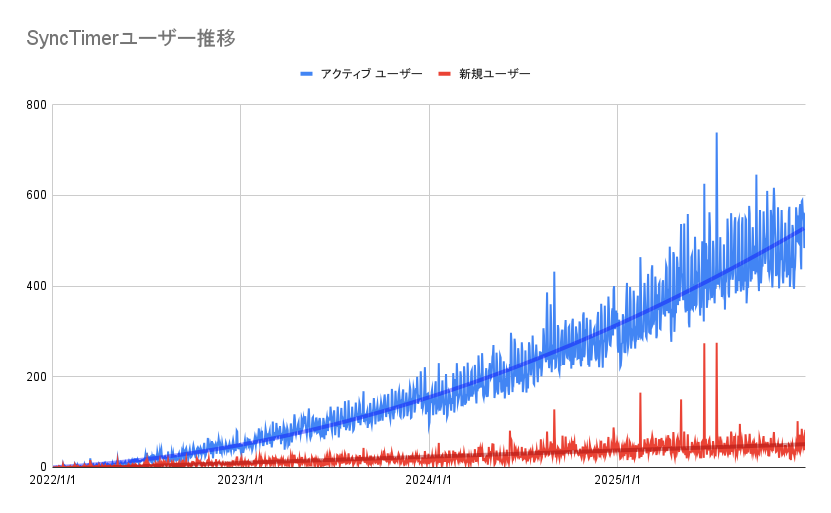

+++ 
date = 2026-04-30T01:12:16+09:00
title = "2022から2025までのSyncTimerのアクセスを振り返ってみる"
description = "2022から2025までのSyncTimerのアクセスを振り返ってみる"
slug = ""
authors = []
tags = ["SyncTimer"]
categories = ["SyncTimer開発"]
externalLink = ""
series = []
+++

[SyncTimer](https://sync-timer.netlify.app/)を開発してから6年ほど経とうとしています。
それほど手を加えているわけではないんですが、今どのくらいアクセスされているのか気になったので昨年までの推移を振り返ってみようと思いました。

## GA4のデータから

2022年から2025年末までのアクティブユーザー数と新規ユーザー数の推移はこんな感じになっています。

ありがたいことにずっと右肩上がりにユーザーが増え続けている状況です。
時々新規ユーザー数が跳ね上がっているときがありますが、こういうときはフォロー数の多い有名な方の配信で概要欄に載っていたり、Xなどで紹介されたりしたときのようです。

折れ線グラフの真ん中に入っている曲線はトレンドラインといって、グラフのおおよその形を多項式で表現してみたものです。アクティブユーザーはおおよそ2次関数でフィットできました。新規ユーザーの増加はおおよそ線形（1次関数）です。
このことから、次のようなことが推測できます。

- SyncTimerを使う人が増えて紹介いただける数が増えたことで、新規ユーザーも増えている。（あるいは同時配信などの配信数がどんどん増えている）
- リピーターが多い。加速度・速度・距離の関係のように、新規ユーザー数の増える勢い（加速度）に対して2次関数的にアクティブユーザー（距離）が増えている。

2023年頃にもゆるやかな右肩上がりだなーと思っていましたが、まさか2次の勢いでアクティブユーザー数が増えていたのはちょっと驚きでした。
たくさんのリピーターに使ってもらえて、開発者としてはとても嬉しいです。

## 今後について

映像の時間に対してカウントダウンを並記してほしい、などいくつか要望は届いています。ただ、そのような機能要望についてはSyncTimerで対応する予定はありません。あくまで当初の設計である「マイナスからカウントダウンし、そのままカウントアップに入るタイマー」で行こうと思っています。

また、このサービスによる収入はありませんし、本業にしっかりと取り組む必要があるため、これ以降の追加開発はないと思っていてください。（これまで何回か言ってますね…）

もし、フォークして開発してみたい物好きな方がいれば、ご自由にお使いください。もちろん、うまくいかなくても責任は取れませんが…。

また機会があればアクセス数などの状況を確認して報告できるかもしれません。

それでは。
